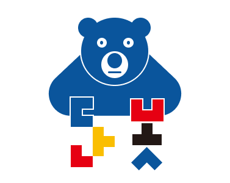
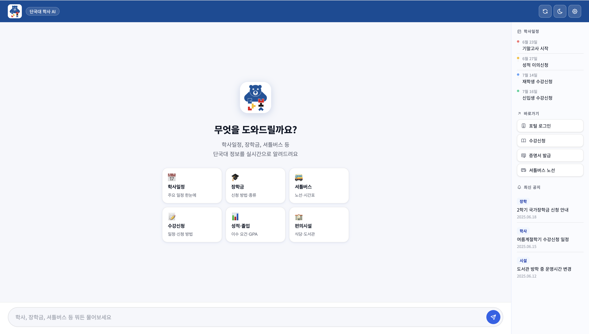
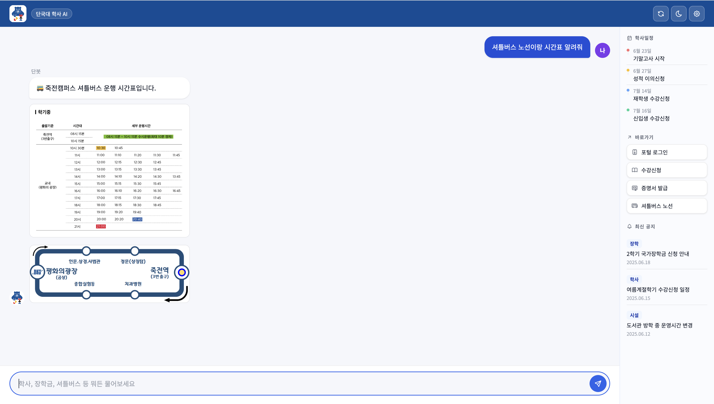
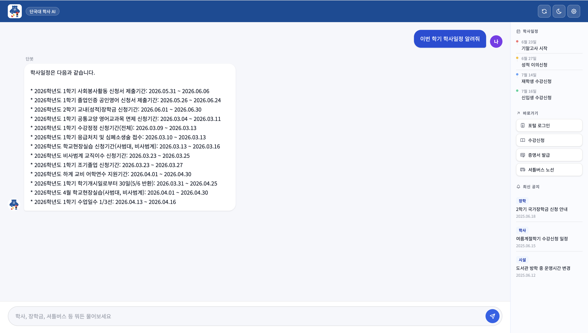
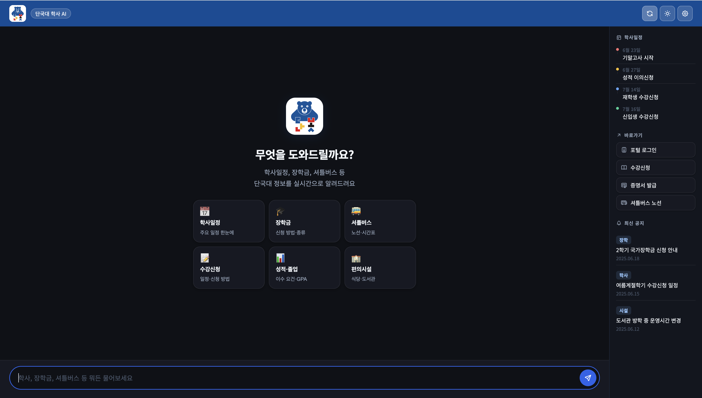

<div align="center">



# 단봇 DAN-BOT

**단국대학교 학생들을 위한 실시간 학사 정보 AI 에이전트**


</div>

---

## 📌 프로젝트 소개

매 학기 학생들은 수많은 학사 공지와 복잡한 규정 사이에서 자신에게 필요한 정보를 찾는 데 많은 시간을 사용합니다. 현재 단국대학교는 이러한 질의에 실시간으로 대응할 수 있는 전용 챗봇 시스템이 부재한 상황입니다.

**단봇(DAN-BOT)** 은 이러한 불편함을 해소하기 위해 개발되었습니다. 본 프로젝트는 **로컬 LLM(Llama 3.2)** 과 실시간 웹 크롤링(Selenium) 기술을 결합한 RAG(Retrieval-Augmented Generation) 아키텍처를 기반으로 하며, 학생들의 자연어 질문에 대해 학교 공식 데이터를 실시간으로 분석하여 가장 정확한 최신 정보를 제공합니다.

---

## ✨ 핵심 가치

| | 가치 | 설명 |
|---|---|---|
| ⚡ | **Zero-Delay Information** | 홈페이지 메뉴를 헤맬 필요 없이 단 한 번의 질문으로 원하는 정보에 도달합니다 |
| 🔒 | **Privacy-First AI** | Ollama 기반 로컬 LLM을 운용하여 학생의 질의 데이터가 외부로 유출되지 않는 보안 환경을 제공합니다 |
| 🔗 | **Source Verifiability** | 모든 답변에 실제 학사 공지 링크를 매핑하여 AI의 답변을 사용자가 즉시 검증할 수 있습니다 |

---

## 🖥️ 미리보기






```
┌─────────────────────────────────────────────────────┐
│                    단봇 DAN-BOT                     │
├─────────────────────────────────────────────────────┤
│                                                     │
│           무엇을 도와드릴까요?                        │
│    학사일정, 장학금, 셔틀버스 등 단국대 정보를          │
│           실시간으로 알려드려요                        │
│                                                     │
│   [📅 학사일정]  [🎓 장학금]  [🚌 셔틀버스]          │
│   [📝 수강신청]  [📊 성적·졸업] [🏫 편의시설]         │
│                                                     │
│  나 ▶  2학기 수강신청 일정 알려줘                     │
│  단 ▶  📅 재학생 — 7월 14일(월) 오전 10:00           │
│        📅 신입생 — 7월 16일(수) 오전 10:00           │
│        출처: 학사처 공지 · dankook.ac.kr             │
└─────────────────────────────────────────────────────┘
```

---

## 🚀 주요 기능

| 기능 | 상세 설명 |
|---|---|
| 🧠 자연어 의도 분석 | 사용자의 비정형 질의를 분석하여 학사/장학/시설 등의 카테고리로 자동 매핑 |
| 🌐 실시간 웹 스크래핑 | 질문 시점에 단국대 홈페이지에 즉시 접속하여 최신 공지 및 규정 데이터 추출 |
| 💬 하이브리드 답변 생성 | 수집된 실시간 데이터와 LLM의 추론 능력을 결합한 요약 답변 생성 |
| 🔗 지능형 출처 매핑 | 답변의 근거가 되는 원문 URL을 자동으로 탐색하여 답변과 함께 제공 |
| 🗺️ 멀티미디어 가이드 | 캠퍼스 시설 및 위치 문의 시 시각적 이미지(맵) 동시 노출 |
| ⚡ 퀵 메뉴 시스템 | 학사일정, 편의시설 등 빈도가 높은 질문을 원클릭으로 처리하는 UX 제공 |
| 🔐 로컬 AI 보안 | Ollama를 이용한 로컬 서버 운영으로 학생 질의 데이터 보안 유지 |

---

## 🛠️ 기술 스택

### Backend
| 기술 | 용도 |
|---|---|
| Python 3.12 | 메인 언어 |
| Flask | 웹 프레임워크 및 API 서버 |
| Selenium WebDriver | 실시간 동적 웹 크롤링 |

### Frontend
| 기술 | 용도 |
|---|---|
| HTML / CSS / JS | 채팅 UI 인터페이스 |
| Git, GitHub | 버전 관리 |

### AI
| 기술 | 용도 |
|---|---|
| Llama 3.2 | 로컬 LLM 모델 |
| Ollama | 로컬 LLM 서빙 |
| RAG / Context Injection | 실시간 데이터 기반 답변 생성 |

---

## 🏗️ 시스템 아키텍처

단봇은 학생의 질문으로부터 답변까지 다음과 같은 RAG 프로세스를 거칩니다.

```
사용자 질문
    │  대화창을 통해 자연어 질문 입력
    ▼
의도 분석
    │  Flask 서버에서 질문의 키워드 및 의도 분석
    ▼
실시간 검색
    │  Selenium이 타겟 페이지에 접속하여 최신 학사 데이터 수집
    ▼
AI 추론
    │  수집된 데이터를 Llama 3.2 모델에 주입(Context Injection)하여 답변 생성
    ▼
최종 응답
     요약 답변 + 관련 이미지 + 원문 링크를 사용자에게 최종 출력
```

---

## 🗺️ 개발 로드맵

### ✅ Phase 1 — Foundation `W1 ~ W4`
- [x] 요구사항 정의 및 시스템 아키텍처 설계
- [x] Selenium 기반 동적 웹 크롤링 엔진 및 예외 처리 시스템 구축

### 🔄 Phase 2 — Intelligence `W5 ~ W7`
- [x] Ollama 서빙 및 RAG 로직 최적화 (프롬프트 엔지니어링)
- [ ] Flask 기반 백엔드 API와 프론트엔드 채팅 UI 연동

### 📋 Phase 3 — Optimization `W8 ~ W10`
- [ ] 데이터 정합성 검증 및 할루시네이션(환각) 방지 필터링 테스트
- [ ] 베타 테스트 피드백 반영 및 최종 문서화

---

## 📁 프로젝트 구조

```
dan-bot/
├── assets/                   # README용 이미지, 로고, UML 다이어그램
├── docs/                     # 설계 문서
│   ├── UserGuide.md          # 사용자 매뉴얼
│   └── DeveloperGuide.md     # 시스템 설계 및 API 명세서
├── src/                      # 메인 소스 코드 디렉토리
│   ├── crawler/              # Selenium 기반 웹 스크래핑 모듈
│   │   ├── __init__.py
│   │   └── scraper.py        # 단국대 홈페이지 동적 파싱 로직
│   ├── ai_engine/            # Ollama 및 LLM 연동 모듈
│   │   ├── __init__.py
│   │   ├── llm_handler.py    # Llama 3.2 모델 호출 및 프롬프트 제어
│   │   └── rag_logic.py      # 컨텍스트 주입 및 데이터 요약 로직
│   ├── static/               # 프론트엔드 정적 파일 (CSS, JS, 이미지)
│   ├── templates/
│   │   └── index.html        # 메인 채팅 인터페이스
│   └── app.py                # Flask 메인 서버 실행 파일
├── tests/                    # 유닛 테스트 및 성능 검증 코드
├── .gitignore
├── README.md
└── requirements.txt          # 프로젝트 의존성 라이브러리 목록
```

---

## ⚙️ 실행 가이드

### 사전 요구사항
- Python 3.12 이상
- [Ollama](https://ollama.ai) 설치

### 설치 및 실행

```bash
# 1. 레포지토리 클론
git clone https://github.com/compose-coffee/dan-bot.git
cd dan-bot

# 2. 가상환경 설정 및 패키지 설치
python -m venv venv
source venv/bin/activate  # Windows: venv\Scripts\activate
pip install -r requirements.txt

# 3. 로컬 AI 모델 실행 (Ollama 필요)
ollama run llama3.2

# 4. 서버 구동
python src/app.py
```

서버 실행 후 브라우저에서 `http://localhost:5000` 접속

---

## 👥 팀원

| 이름 | 역할 |
|---|---|
| 임찬형 | 전체 시스템 설계, Flask 서버 구축 및 모듈 통합 관리 |
| 김희수 | 실시간 크롤링 엔진 구축 및 데이터 정제 알고리즘 구현 |
| 정지윤 | Ollama 모델 최적화 및 RAG 시스템 아키텍처 설계 |
| 주예나 | 웹 UI 개발, 시각 자산 관리 및 기술 문서화 |

---

## 📄 라이선스

이 프로젝트는 [MIT License](LICENSE) 하에 배포됩니다.

```
MIT License

Copyright (c) 2025 compose-coffee

Permission is hereby granted, free of charge, to any person obtaining a copy
of this software and associated documentation files (the "Software"), to deal
in the Software without restriction, including without limitation the rights
to use, copy, modify, merge, publish, distribute, sublicense, and/or sell
copies of the Software, and to permit persons to whom the Software is
furnished to do so, subject to the following conditions:

The above copyright notice and this permission notice shall be included in all
copies or substantial portions of the Software.
```

---

<div align="center">
  <sub>단국대학교 오픈소스SW기초 3분반 · 2026</sub>
</div>
